# Evidencias - RA2 SBD

Completa solo los campos de datos personales y los pendientes marcados.
No incluyas secretos.

Variante usada para acceso a S3 desde EC2:
- Variante A: IAM Role / Instance Profile (recomendada)
- Variante B: `aws configure` en EC2

## 0) Identificacion
- Alumno/a: `<NOMBRE_APELLIDOS>`
- Grupo: `<GRUPO>`
- Variante usada (A/B): `A` (segun captura de role asociado)
- Region AWS: `<REGION>`
- Bucket S3: `<NOMBRE_BUCKET>`
- Repositorio GitHub (fork): `<URL_REPO>`

---

## 1) S3 privado
- [x] Captura del bucket (nombre y region)
  - Archivo: `docs/capturas/05_bucket_privado.png`
  - 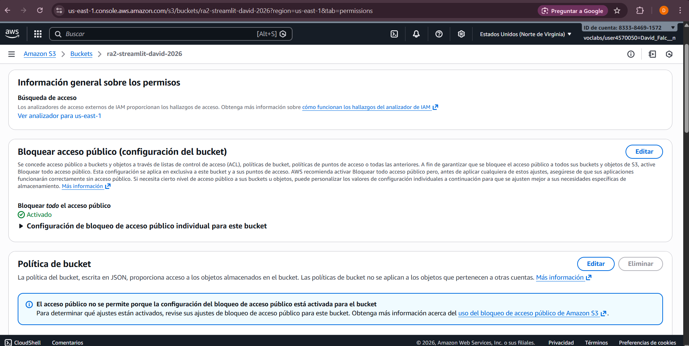
- [x] Captura de Block Public Access / confirmacion privado
  - Archivo: `docs/capturas/05_bucket_privado.png`
  - 
- [x] Captura del objeto JSON en `data/sensores/`
  - Archivo: `docs/capturas/06_prefijo_data_sensores.png`
  - 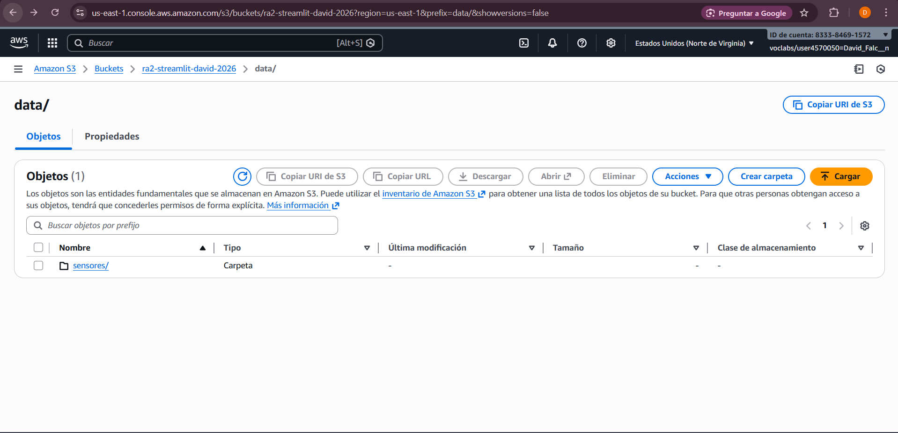
  - Archivo: `docs/capturas/09_json_subido_correcto.png`
  - 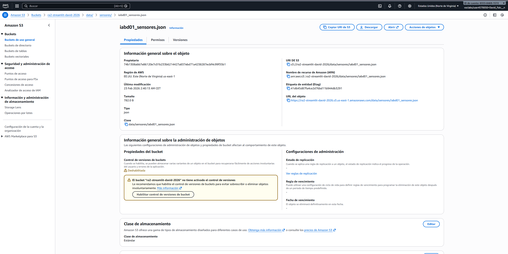

Datos:
- `S3_KEY` usada: `data/sensores/iabd01_sensores.json`

---

## 2) Notebook / Script de subida
- [x] Captura de ejecucion de subida a S3
  - Archivo: `docs/capturas/03_script_subida_s3.png`
  - 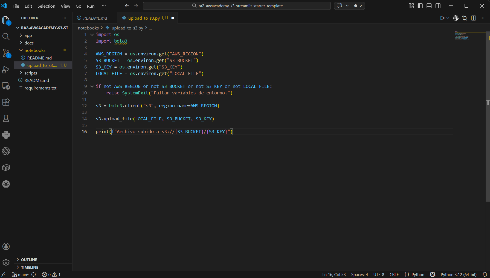
- [x] Ruta del archivo de ingesta en el repo
  - `notebooks/upload_to_s3.py`

Apoyo adicional:
- Archivo: `docs/capturas/08_json_local.png`
- 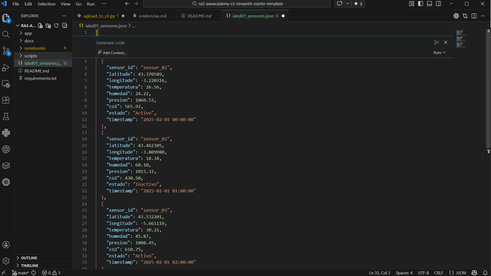

Comando ejecutado:

```bash
python notebooks/upload_to_s3.py \
  --input iabd01_sensores.json \
  --bucket <TU_BUCKET> \
  --region <TU_REGION> \
  --key data/sensores/iabd01_sensores.json
```

---

## 3) EC2 y red
- [x] Captura de EC2 Ubuntu 22.04
  - Archivo: `docs/capturas/11_instancia_running.png`
  - 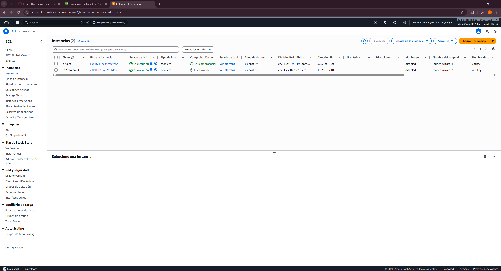
- [x] Captura del Security Group con puerto 8501
  - Archivo: `docs/capturas/10_security_group.png`
  - 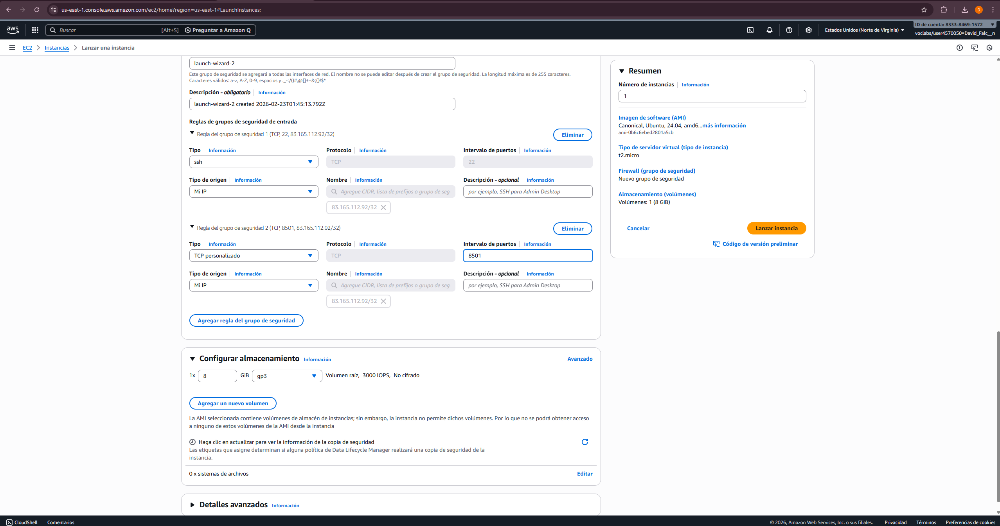
- [x] Captura/salida de SSH conectado
  - Archivo: `docs/capturas/12_ssh_conectado.png`
  - 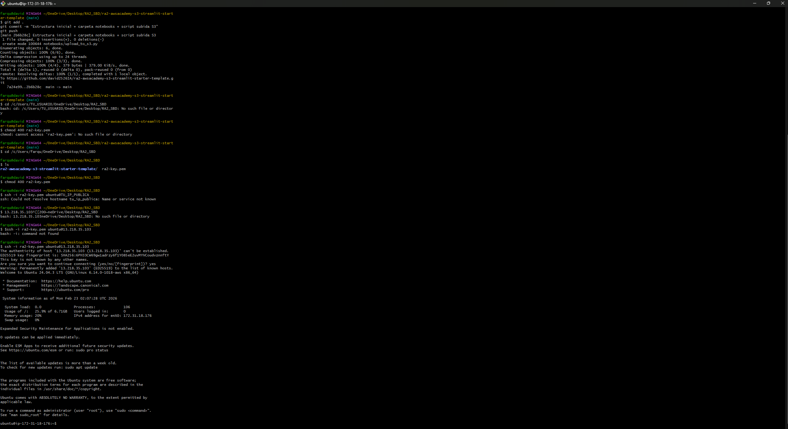

---

## 4) Acceso a S3 desde EC2 (sin secretos)
Comandos:

```bash
aws sts get-caller-identity
aws s3 ls s3://<BUCKET>/data/sensores/
```

- [ ] Captura de `aws sts get-caller-identity` (pendiente especifica)
  - Archivo sugerido: `docs/capturas/27_sts_get_caller_identity.png`
- [x] Captura de `aws s3 ls .../data/sensores/`
  - Archivo: `docs/capturas/24_bucket_content_ok.png`
  - 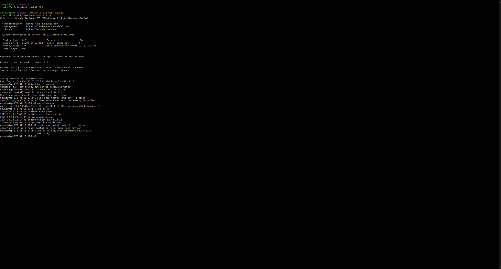
  - Archivo: `docs/capturas/25_s3_json_detectado.png`
  - 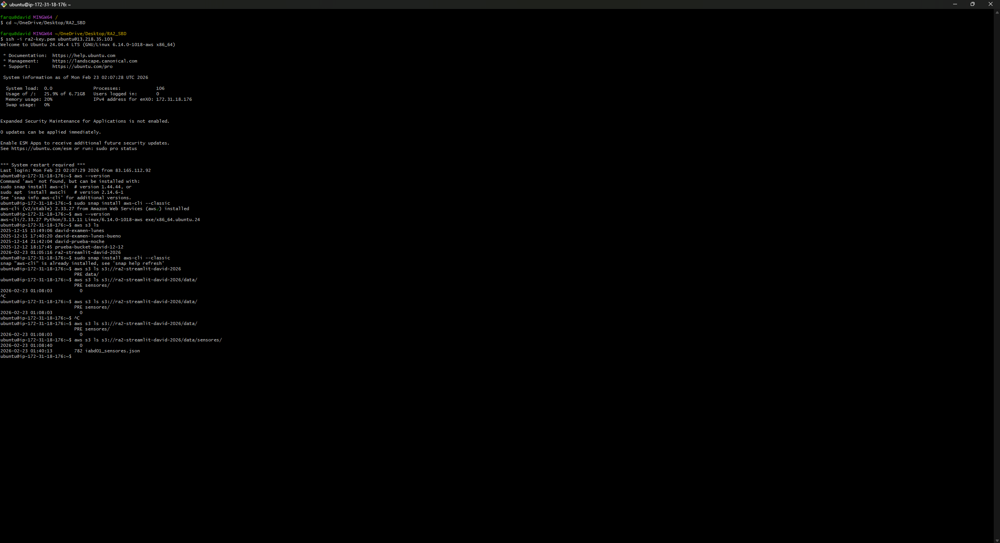

Apoyo adicional (Variante A IAM Role):
- Archivo: `docs/capturas/22_labinstanceprofile_asignado.png`
- 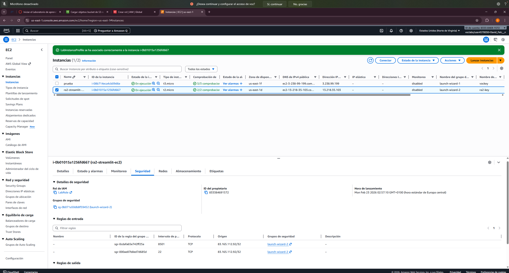

---

## 5) Streamlit en EC2
- [x] Captura de comprobacion Streamlit (`streamlit hello` o `python -c "import streamlit"`)
  - Archivo: `docs/capturas/18_streamlit_hello_browser.png`
  - 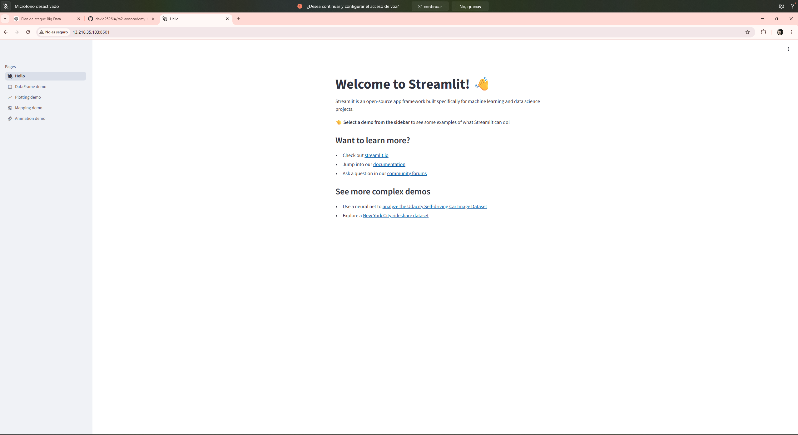
- [x] Captura de instalacion de dependencias
  - Archivo: `docs/capturas/15_requirements_instalados.png`
  - 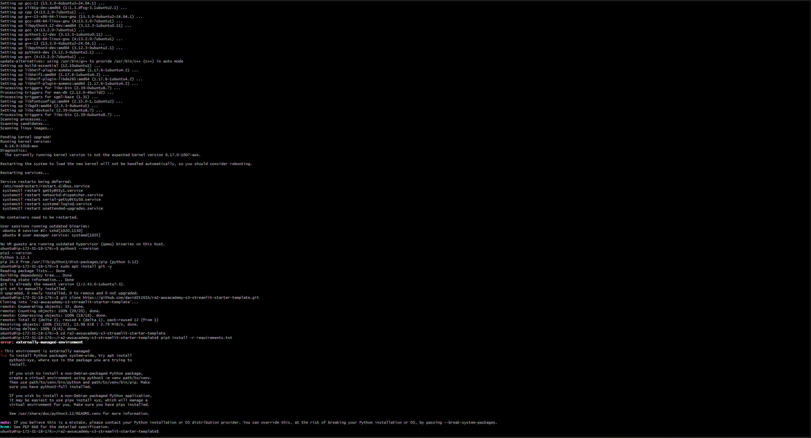
  - Archivo: `docs/capturas/16_requirements_ok.png`
  - 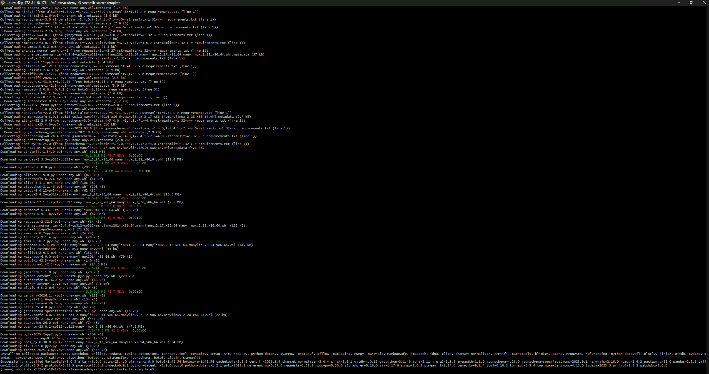

---

## 6) Dashboard (funcionalidad)
- [x] Filtro por `sensor_state`
  - Archivo: `docs/capturas/20_dashboard_ok_browser.png`
  - 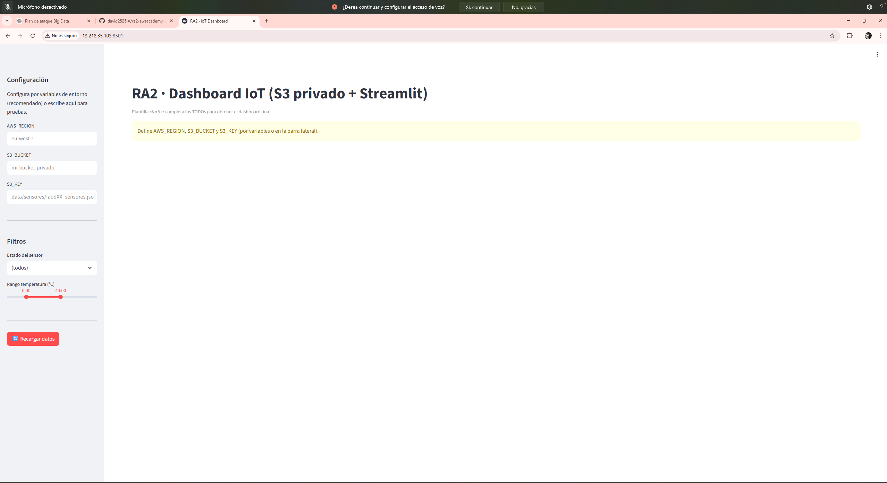
- [x] Slider de temperatura
  - Archivo: `docs/capturas/20_dashboard_ok_browser.png`
  - 
- [ ] Tabla filtrada (pendiente captura especifica)
  - Archivo sugerido: `docs/capturas/28_dashboard_tabla_filtrada.png`
- [ ] Grafica linea (temperatura vs tiempo) (pendiente captura especifica)
  - Archivo sugerido: `docs/capturas/29_dashboard_grafica_linea_temperatura.png`
- [ ] Grafica barras (CO2 por sensor) (pendiente captura especifica)
  - Archivo sugerido: `docs/capturas/30_dashboard_grafica_barras_co2.png`
- [ ] Mapa con sensores (pendiente captura especifica)
  - Archivo sugerido: `docs/capturas/31_dashboard_mapa_sensores.png`

---

## 7) Despliegue final
- [x] Captura del comando de arranque en segundo plano
  - Archivo: `docs/capturas/17_streamlit_running_terminal.png`
  - 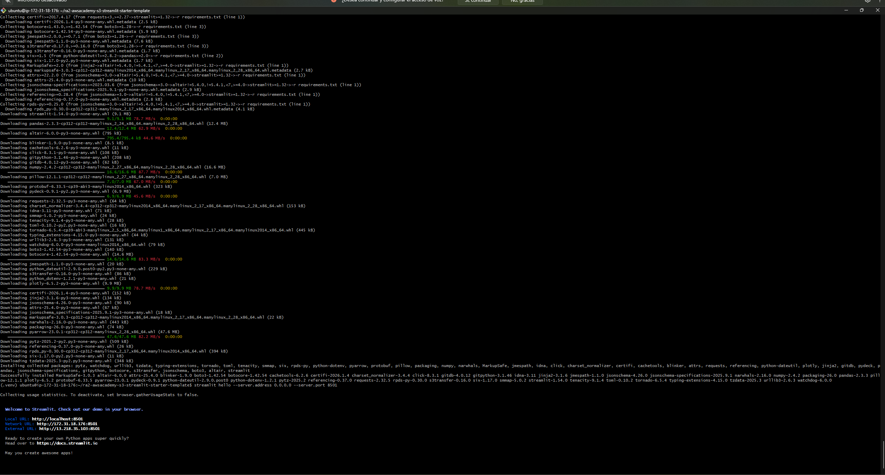
- [x] Captura de log / salida de ejecucion de Streamlit
  - Archivo: `docs/capturas/19_dashboard_ok_terminal.png`
  - 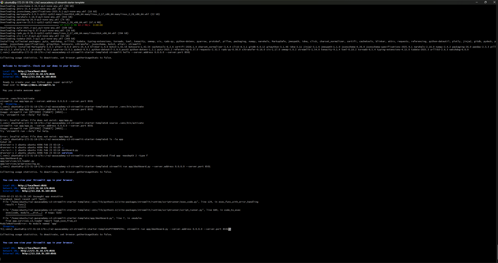
- [ ] URL final publica
  - URL: `http://<IP_PUBLICA_EC2>:8501`
- [x] Captura en navegador accediendo a la URL
  - Archivo: `docs/capturas/20_dashboard_ok_browser.png`
  - 

---

## 8) Observaciones
Problemas encontrados y solucion aplicada:
- Problema 1: error de import (`ModuleNotFoundError: No module named 'app'`) al arrancar Streamlit desde EC2.
- Solucion 1: arrancar con `PYTHONPATH=. streamlit run app/dashboard.py --server.address 0.0.0.0 --server.port 8501` o usar el script de arranque del repo.

---

## 9) Checklist final de entrega
- [x] README actualizado y claro
- [x] `docs/evidencias.md` con capturas vinculadas
- [x] Capturas ordenadas en `docs/capturas/`
- [x] Sin secretos en el repositorio (revisar antes del push final)
- [ ] Tag publicado: `v1.0-entrega` (pendiente)

Comandos de tag:

```bash
git tag v1.0-entrega
git push origin v1.0-entrega
```
